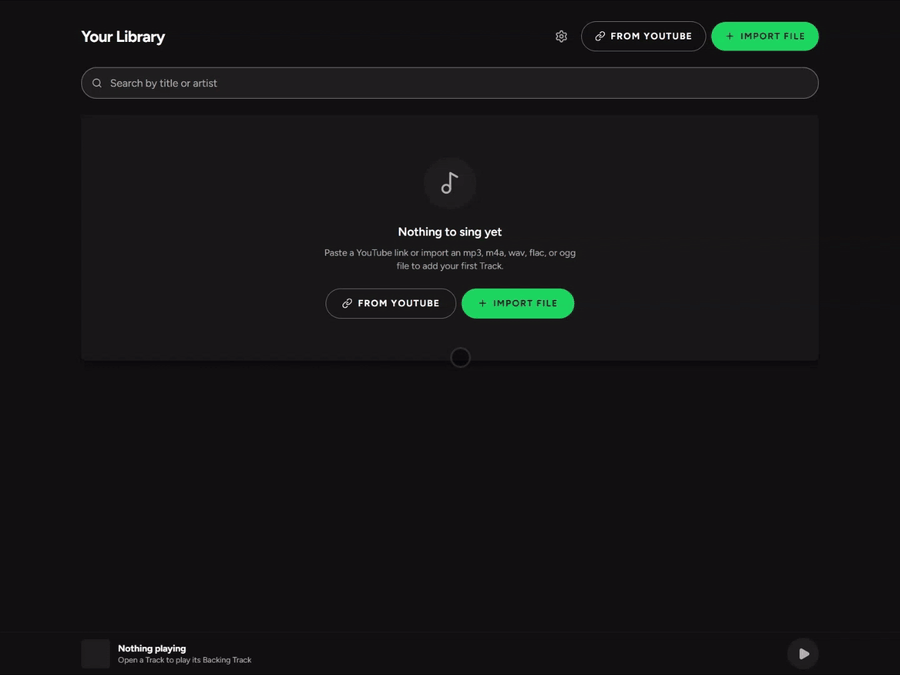

<p align="center">
  
</p>

Self-hosted karaoke. Import a song from YouTube or a file, get a Backing Track with synced Lyrics, adjust the pitch and tempo, sing, and end up with a finished recording.

Everything stays on your machine — the audio, your recordings, and the database. Nothing is uploaded anywhere. The only outside services Akapela talks to are the Lyrics providers you choose to use.

## What it does

- **Import** a Track from a YouTube link or an `mp3`, `m4a`, `wav`, `flac`, or `ogg` file.
- **Identify** the Song and fetch its Lyrics from LRCLIB, or from Genius as well if you give it a token, or paste them yourself. Synced Lyrics scroll as you sing; a per-Track Lyrics Offset lines them up when the intro differs from the studio version.
- **Adjust** pitch and tempo, independently or linked.
- **Sing** to the Backing Track and record a Take.
- **Review** the Take: nudge your voice earlier or later against the Backing Track, set the vocal and backing levels, and render a Mix.
- **Download** the Mix as MP3, or as WAV if you want the lossless version.

<p align="center">
  
</p>

_The whole loop, start to finish: an empty library, a Track imported from YouTube, its vocals separated into Stems, singing to synced Lyrics and recording a Take, then Review — pitch, Backing Source, and the Effects — and a rendered Mix played back._

## Running it

Download it, open it, sing. Nothing else to install.

**[Download Akapela](https://github.com/kawishbit/akapela/releases/latest)** — Windows, macOS, and a Linux AppImage. Check the release for which of those it actually carries; see [ADR 0009](docs/adr/0009-electron-wraps-the-server.md) for how the app is put together.

Your library lives in the app's own folder by default. Settings shows you where, and lets you point it somewhere else — including at a folder a server install already built, which opens that library as it is.

**On macOS**, the app is for Apple Silicon Macs (M1 and later); there is no Intel build. Drag Akapela into Applications before you open it. It isn't notarized by Apple yet, so the first time you open it macOS says **Apple could not verify "Akapela" is free of malware** and offers only **Done** and **Move to Bin**. Choose **Done**, then, once:

1. Open **System Settings → Privacy & Security** and scroll down to **Security**. It says **"Akapela" was blocked to protect your Mac**.
2. Choose **Open Anyway**, then **Open Anyway** again in the box that follows, and confirm with your password or Touch ID.

After that it opens like any other app. On macOS 15 and later, right-click → **Open** no longer offers a way past the message; Privacy & Security is the only route.

**On Windows**, the installer isn't signed yet. SmartScreen will show a blue "Windows protected your PC" box the first time; choose **More info**, then **Run anyway**. That's the whole of it, and it only happens once.

**Updates.** The app checks for a newer release when it starts, and asks whether you want it. It never interrupts you mid-song: if you're on the Sing or Take screen, the question waits until you leave. You can take it, be asked again next time, or skip that release for good.

On **Windows** and on the **Linux AppImage**, saying yes downloads the update and installs it for you — you choose whether to restart straight away or have it installed the next time you quit. A restart waits while a Job is still running, so an update never throws away a separation that's halfway done.

On **macOS**, saying yes opens the download page instead, because macOS refuses to update an app that isn't signed, and this one isn't yet. Anything that goes wrong on the other two platforms ends the same way: a link to the release, and your library untouched.

Settings has a **Check on launch** switch (on by default — turned off, Akapela never contacts GitHub on its own) and a **Check now** button. If you're on **1.0.2 or older**, install the first release that has this by hand, once; after that, updates install themselves.

### Run it on a server

If you'd rather have Akapela on all the time, reachable from every device in the house, run it with Docker instead. It's the same app.

Akapela runs as one Docker container with one data folder. Docker with Compose is the only thing you need to install.

```
git clone https://github.com/kawishbit/akapela.git
cd akapela
docker compose up -d
```

You'll also need Git, just to grab the code above.

Then open <http://localhost:3000>.

To configure it, copy `.env.example` to `.env` and edit it:

```
cp .env.example .env
```

- `AKAPELA_PORT` — the host port, `3000` by default.
- `AKAPELA_DATA` — where your library lives. Left unset, it's the named Docker volume `akapela-data`. Set it to a folder on your machine (relative to the compose file, or an absolute path) if you'd rather browse the files yourself.
- `AKAPELA_GENIUS_TOKEN` — optional. With a token from [genius.com/api-clients](https://genius.com/api-clients), Genius joins LRCLIB as a place to look up Lyrics, and it also supplies album art. Leave it unset and Genius just won't be offered.

To update, pull the latest code and rebuild:

```
git pull
docker compose up -d --build
```

Running `docker compose up -d` on its own just reuses the image you already built, so use `--build` whenever you've pulled new code. The database migrates itself on startup — there's no separate step for that.

**Back it up from Settings.** "Download backup" gives you a WAL-checkpointed archive of everything that isn't re-downloadable — the database, every Track's audio, every Take and Mix — leaving out the separation model, which just downloads again if it's ever missing. "Restore from backup" replaces your entire library with what's in the file and restarts the app; `docker compose` brings it straight back up, and so does the downloadable app. You can still copy the data folder by hand while the stack is stopped, if you'd rather.

Both halves read the same data folder and the same database, so **a backup archive moves between the downloadable app and a Docker install in either direction** — take a backup on one, restore it on the other. You can also just point the downloadable app straight at a folder Docker built, from Settings, and it opens that library as it is.

**There is no login.** Akapela has no accounts and no authentication: anyone who can reach the port can see your library and everything you've recorded. It's built to run on a machine on your own network. If you want it reachable from outside your network, put it behind something that checks who's asking — a reverse proxy with authentication, or a VPN — and let that handle TLS too.

### When YouTube imports break

Akapela fetches YouTube audio with [yt-dlp](https://github.com/yt-dlp/yt-dlp). YouTube changes its site without warning, so an import that worked last month can suddenly stop working. If that happens, an updated yt-dlp has almost always already shipped.

**In the downloadable app**, open Settings and press **Update yt-dlp**. The app keeps its own copy, so that's the whole fix — no reinstalling, nothing to wait for.

**Under Docker**, yt-dlp is baked into the image, so updating it means rebuilding:

```
git pull
docker compose up -d --build
```

If pulling gets you nothing newer, the breakage is probably too fresh for a fix yet — check [yt-dlp's issue tracker](https://github.com/yt-dlp/yt-dlp/issues) for the same problem, and try again once a fix lands there. Importing an audio file directly is unaffected either way.

### Hardware

Any machine that can run one small container will do. `docker-compose.yml` allots it two cores and 2 GB — that's a starting point, not a hard limit, and rendering a Mix of a normal-length song takes only a couple of seconds well within it.

Vocal removal (Separate on a Track) costs more, but only if you use it: a few minutes of CPU per song. It's queued alongside everything else, one Track at a time, so it never competes with a Mix render. The two Stems it produces add roughly 80 MB per Track on disk, on top of the Track's own audio. The separation model itself isn't bundled with the app — the first time you use it, Akapela downloads it into your data folder, a one-time download that survives future updates since it lives with your data, not inside the container.

## Contributing

If you just want to run Akapela, `docker compose up -d` above is all you need — everything in this section is for working on the code itself.

Development doesn't use Compose. Instead it uses an [Aspire](https://aspire.dev) AppHost that runs the app as a local process with hot reload and streams its logs and traces into one Dashboard. This is purely a development tool — it's not part of what ships, and it's never something a self-hoster needs to install (see [ADR 0007](docs/adr/0007-aspire-for-local-development.md)).

You'll need:

- **Node 22.19+, 24.11+, or 26+** (Nuxt's supported range, which skips 23 and 25) and **pnpm** — run `corepack enable` and pnpm's pinned version in `package.json` takes care of the rest.
- **The [Aspire CLI](https://aspire.dev)**, for local development.
- **Docker**, only if you're changing the Dockerfile or `docker-compose.yml` and want to confirm the shipped build still works.
- **`ffmpeg`** on your PATH — the app calls it for every import and every Mix. The AppHost checks for it at startup and flags the app as unhealthy in the Dashboard if it's missing, so you catch it immediately rather than an hour in. The test suite also uses `ffprobe`, which every ffmpeg package ships alongside it.
- **[yt-dlp](https://github.com/yt-dlp/yt-dlp#installation)** on your PATH, for YouTube imports. Missing, the app still starts — only YouTube imports are affected, and the Dashboard will say so; uploading a file directly is unaffected either way.

Node also doubles as the JavaScript runtime yt-dlp needs to get past YouTube's player checks. Without it, YouTube imports still work but with fewer format options, and the Dashboard will let you know.

Then:

```
pnpm install
aspire run
```

`aspire run` works from anywhere in the repo. It opens the Aspire Dashboard with a link to the running app plus its logs and traces. `pnpm dev` runs the app on its own the same way, without the Dashboard.

None of the checks need the AppHost running:

```
pnpm lint
pnpm typecheck
pnpm test
```

The desktop shell lives in `desktop/`, and it's deliberately thin — it starts the same server and points a window at it ([ADR 0009](docs/adr/0009-electron-wraps-the-server.md)), so almost every change still belongs in the Nuxt app. It's installed and run from inside its own directory, the way `apphost/` is, because Electron is a several-hundred-megabyte dependency the root install must never see:

```
cd desktop
pnpm install
AKAPELA_SERVER_URL=http://localhost:3000 pnpm dev
```

That opens a window on a server you're already running in another terminal, so hot reload and the Dashboard keep working. `AGENTS.md` covers building an actual installer.

A few docs are worth reading before you dig in: `AGENTS.md` covers day-to-day development, configuring the AppHost, and reading traces; `CONTEXT.md` defines the project's vocabulary (Track, Song, Take, and Mix all have precise meanings here, and the code uses those exact words); `DESIGN.md` covers the visual design system; and `docs/adr/` records the reasoning behind past decisions.

## Roadmap

Nothing here is scheduled yet — this is roughly the order they'd get tackled in:

- [x] Backup and restore from within the app
- [x] A desktop app (Electron)
- [ ] Spotify import
- [ ] Deezer import
- [ ] SoundCloud import
- [ ] AI-assisted Lyrics syncing
- [ ] Auto latency calibration
- [ ] YouTube video playback alongside the Backing Track
- [ ] Localisation

## Licence

GPL-3.0-only. See [LICENSE](LICENSE).

Akapela renders Mixes with [Rubber Band](https://breakfastquay.com/rubberband/), which is GPL — see [ADR 0004](docs/adr/0004-rubber-band-and-gpl-license.md) for what that means for this project.
