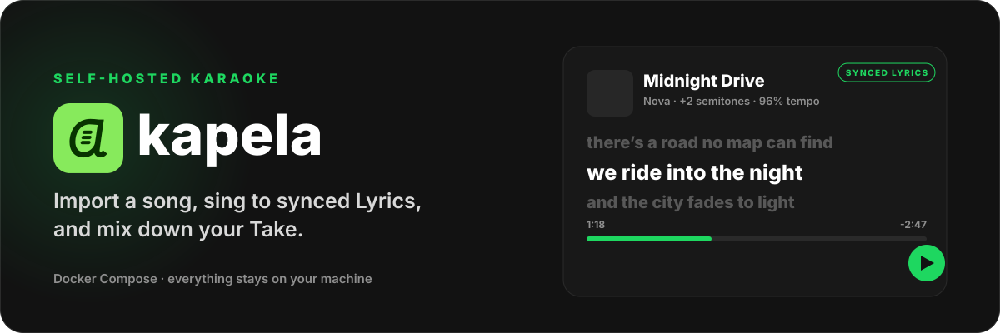

<p align="center">
  
</p>

Self-hosted karaoke. Import a song from YouTube or a file, get a Backing Track with synced Lyrics, adjust the pitch and tempo, sing, and end up with a finished recording.

Everything stays on your machine — the audio, your recordings, and the database. Nothing is uploaded anywhere. The only outside services Akapela talks to are the Lyrics providers you choose to use.

## What it does

- **Import** a Track from a YouTube link or an `mp3`, `m4a`, `wav`, `flac`, or `ogg` file.
- **Identify** the Song and fetch its Lyrics from LRCLIB, or from Genius as well if you give it a token, or paste them yourself. Synced Lyrics scroll as you sing; a per-Track Lyrics Offset lines them up when the intro differs from the studio version.
- **Adjust** pitch and tempo, independently or linked.
- **Sing** to the Backing Track and record a Take.
- **Review** the Take: nudge your voice earlier or later against the Backing Track, set the vocal and backing levels, and render a Mix.
- **Download** the Mix as MP3, or as WAV if you want the lossless version.

## Running it

Akapela runs as two Docker containers sharing one data folder: one serves the app itself, the other handles imports and renders your Mixes. Docker with Compose is the only thing you need to install.

```
git clone https://github.com/kawishbit/akapela.git
cd akapela
docker compose up -d
```

You'll also need Git, just to grab the code above.

Then open <http://localhost:3000>.

To configure it, copy `.env.example` to `.env` and edit it:

```
cp .env.example .env
```

- `AKAPELA_PORT` — the host port, `3000` by default.
- `AKAPELA_DATA` — where your library lives. Left unset, it's the named Docker volume `akapela-data`. Set it to a folder on your machine (relative to the compose file, or an absolute path) if you'd rather browse the files yourself.
- `AKAPELA_GENIUS_TOKEN` — optional. With a token from [genius.com/api-clients](https://genius.com/api-clients), Genius joins LRCLIB as a place to look up Lyrics, and it also supplies album art. Leave it unset and Genius just won't be offered.

To update, pull the latest code and rebuild:

```
git pull
docker compose up -d --build
```

Running `docker compose up -d` on its own just reuses the image you already built, so use `--build` whenever you've pulled new code. The database migrates itself on startup — there's no separate step for that.

**Backups are your job.** Everything — the database, every Track's audio, every Take and Mix — lives in that one data folder. Copy it while the stack is stopped.

**There is no login.** Akapela has no accounts and no authentication: anyone who can reach the port can see your library and everything you've recorded. It's built to run on a machine on your own network. If you want it reachable from outside your network, put it behind something that checks who's asking — a reverse proxy with authentication, or a VPN — and let that handle TLS too.

### When YouTube imports break

Akapela fetches YouTube audio with [yt-dlp](https://github.com/yt-dlp/yt-dlp). YouTube changes its site without warning, so an import that worked last month can suddenly stop working. If that happens, an updated yt-dlp has almost always already shipped:

```
git pull
docker compose up -d --build
```

If pulling gets you nothing newer, the breakage is probably too fresh for a fix yet — check [yt-dlp's issue tracker](https://github.com/yt-dlp/yt-dlp/issues) for the same problem, and try again once a fix lands there. Importing an audio file directly is unaffected either way.

### Hardware

Any machine that can run two small containers will do. `docker-compose.yml` allots one core and 512 MB to the app, and two cores and 2 GB to the worker — that's a starting point, not a hard limit, and rendering a Mix of a normal-length song takes only a couple of seconds well within it.

Vocal removal (Separate on a Track) costs more, but only if you use it: a few minutes of CPU per song. It's queued alongside everything else, one Track at a time, so it never competes with a Mix render. The two Stems it produces add roughly 80 MB per Track on disk, on top of the Track's own audio. The separation model itself isn't bundled with the app — the first time you use it, Akapela downloads it into your data folder, a one-time download that survives future updates since it lives with your data, not inside the container.

## Contributing

If you just want to run Akapela, `docker compose up -d` above is all you need — everything in this section is for working on the code itself.

Development doesn't use Compose. Instead it uses an [Aspire](https://aspire.dev) AppHost that runs the app and the Worker as local processes with hot reload, points them at the same data folder, and streams both their logs and traces into one Dashboard. This is purely a development tool — it's not part of what ships, and it's never something a self-hoster needs to install (see [ADR 0007](docs/adr/0007-aspire-for-local-development.md)).

You'll need:

- **Node 22.19+, 24.11+, or 26+** (Nuxt's supported range, which skips 23 and 25) and **pnpm** — run `corepack enable` and pnpm's pinned version in `package.json` takes care of the rest.
- **[uv](https://docs.astral.sh/uv/)**, for the Python Worker.
- **The [Aspire CLI](https://aspire.dev)**, for local development.
- **Docker**, only if you're changing the Dockerfiles or `docker-compose.yml` and want to confirm the shipped build still works.
- **`ffmpeg` and `ffprobe`** on your PATH — the Worker calls them for every import and every Mix. The AppHost checks for both at startup and flags the Worker as unhealthy in the Dashboard if either is missing, naming exactly what's missing so you catch it immediately rather than an hour in.

Node also doubles as the JavaScript runtime yt-dlp needs to get past YouTube's player checks. Without it, YouTube imports still work but with fewer format options, and the Dashboard will let you know.

Then:

```
pnpm install
aspire run
```

`aspire run` works from anywhere in the repo. It opens the Aspire Dashboard with a link to the running app plus both processes' logs and traces, and installs the Worker's Python dependencies for you along the way. Give it a minute the first time.

You can also run either half on its own — `pnpm dev` for the app, `uv run akapela-worker` for the Worker — just make sure they agree on the data folder and port.

None of the checks need the AppHost running:

```
pnpm lint
pnpm typecheck
pnpm test
(cd worker && uv run pytest)
```

A few docs are worth reading before you dig in: `AGENTS.md` covers day-to-day development, configuring the AppHost, and reading traces; `CONTEXT.md` defines the project's vocabulary (Track, Song, Take, and Mix all have precise meanings here, and the code uses those exact words); `DESIGN.md` covers the visual design system; and `docs/adr/` records the reasoning behind past decisions.

## Roadmap

Nothing here is scheduled yet — this is roughly the order they'd get tackled in:

- [ ] Backup and restore from within the app
- [ ] A desktop app (Electron)
- [ ] Spotify import
- [ ] Deezer import
- [ ] SoundCloud import
- [ ] AI-assisted Lyrics syncing
- [ ] Auto latency calibration
- [ ] YouTube video playback alongside the Backing Track
- [ ] Localisation

## Licence

GPL-3.0-only. See [LICENSE](LICENSE).

Akapela renders Mixes with [Rubber Band](https://breakfastquay.com/rubberband/), which is GPL — see [ADR 0004](docs/adr/0004-rubber-band-and-gpl-license.md) for what that means for this project.
