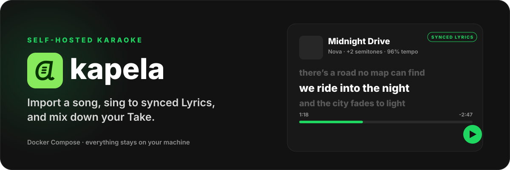
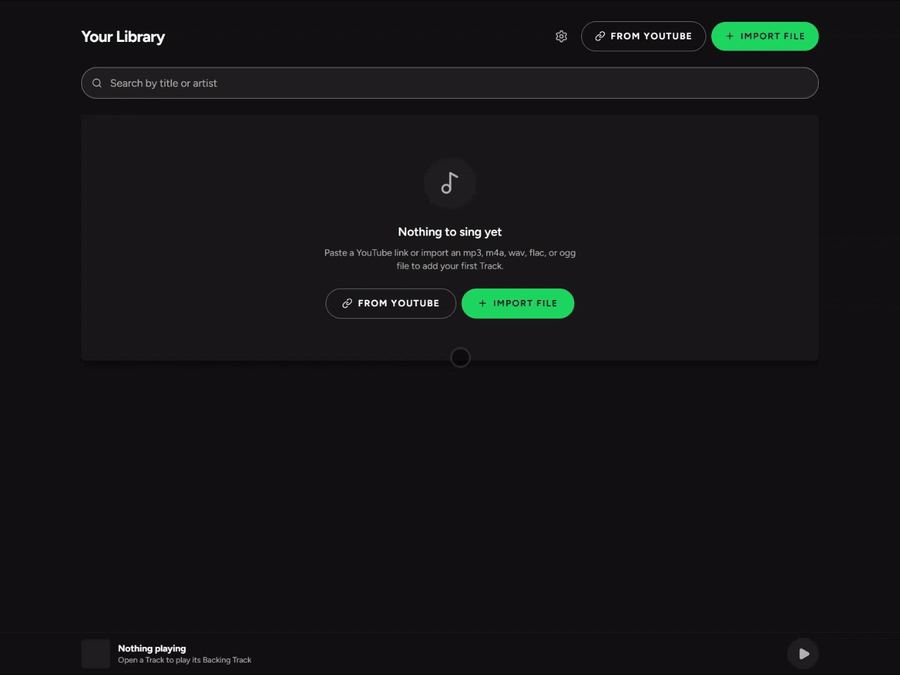

<p align="center">
  
</p>

<p align="center">
  <a href="https://github.com/kawishbit/akapela/releases/latest"></a>
  <a href="https://github.com/kawishbit/akapela/releases"></a>
  <a href="https://github.com/kawishbit/akapela/actions/workflows/desktop-release.yml"></a>
  
  <a href="./LICENSE"></a>
  <a href="https://akapela.kawishbit.com"></a>
</p>

Self-hosted karaoke. Import a song from YouTube or a file, remove the vocals, sing along to synced lyrics with the pitch and tempo you like, and keep the recording.

Everything stays on your machine. The only outside services Akapela talks to are the lyrics providers you choose to use.

<p align="center">
  
</p>

## What it does

- **Import** from a YouTube link or an `mp3`, `m4a`, `wav`, `flac`, or `ogg` file.
- **Remove the vocals** to get an instrumental.
- **Get lyrics** from LRCLIB or Genius, or paste your own. Synced lyrics scroll as you sing.
- **Change pitch and tempo**, and add reverb.
- **Sing and record**, then line your voice up, set the levels, and download the result as MP3 or WAV.

## Get it

### Desktop app

**[Download Akapela](https://github.com/kawishbit/akapela/releases/latest)** for Windows, macOS (Apple Silicon), or Linux (AppImage). Open it and sing; nothing else to install.

The installers aren't signed yet, so the first launch needs one extra click:

- **Windows:** on "Windows protected your PC", choose **More info → Run anyway**.
- **macOS:** choose **Done**, then **System Settings → Privacy & Security → Open Anyway**.

### On a server, with Docker

To reach it from every device in the house, you need Docker with Compose and Git:

```
git clone https://github.com/kawishbit/akapela.git
cd akapela
docker compose up -d
```

Then open <http://localhost:3000>.

> **There is no login.** Anyone who can reach the port can see and use your library. Keep it on your own network, or put it behind a VPN or a reverse proxy with authentication.

For the port, the data folder, the Genius token, updating, and backups, see [Self-hosting](docs/self-hosting.md). If something breaks, see [Troubleshooting](docs/troubleshooting.md).

## Roadmap

Roughly in order. Details in [ROADMAP.md](ROADMAP.md).

- [x] Backup and restore
- [x] Desktop app
- [x] Shorter README
- [x] Jobs page: see and manage everything that's processing
- [x] Queue: line up songs to sing
- [x] Connect the desktop app to your own server
- [x] Vocal removal: choice of model, GPU support, smaller files
- [x] Guide Vocal: keep a little of the original singer to sing along to
- [x] Spotify playlist import
- [ ] More languages
- [ ] Automatic lyrics timing
- [ ] Lyrics syncing for unsynced lyrics
- [ ] Deezer and SoundCloud import
- [ ] Automatic latency calibration
- [ ] YouTube video playback alongside the song

## Contributing

See [CONTRIBUTING.md](CONTRIBUTING.md).

## Licence

GPL-3.0-only. See [LICENSE](LICENSE).
